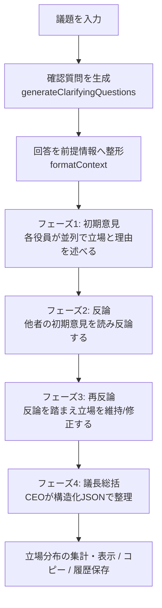

# AI経営会議 (AI Boardroom)

経営課題を投げかけると、役職の異なる役員AIが多角的に議論し、論点・リスク・判断の分かれ目を整理するWebアプリケーションである。最終的に決めるのは人間であり、AIは判断を代行せず、意思決定を支援することに徹している。

役職ごとに人格と観点を与えた複数のAIエージェントを、フェーズごとに並列実行して議論させる、マルチエージェント・オーケストレーションの実装である。

## 解決したい課題

- 一人で重要な意思決定を行うとき、人は自分が賛成している方向に偏り、反対意見やリスクを見落としやすい。
- 単一のAIに相談しても、当たり障りのない総論的な回答になりがちで、立場の対立から生まれる論点が出てこない。
- この課題に対し、立場の異なる複数の役員AIに議論させることで、見落とした論点とリスクを表に出すことを目指した。

## 特徴

このアプリが、単純なAIチャットボットと異なる点は次の3つである。

### 1. 議論の前に、AIが判断に必要な情報を逆質問する

- 議題を入力すると、AIがその議題に応じた確認質問（例: 現在の利益率、競合との価格差、資金繰りの余裕）を生成する。
- ユーザーが回答すると、その情報を前提として議論が行われるため、一般論ではなくその状況に即した議論になる。回答は任意で、スキップもできる。

### 2. 役職の異なるAIが、反論・再反論を交わす2巡の議論

- CFO・CMO・COO・CTO・法務・人事といった役職ごとに異なる視点を持つAIが、それぞれの立場から意見を述べる。
- 各自の初期意見の後、互いの意見への反論、さらに反論への再反論という2巡の構成で、議論を噛み合わせる。

### 3. AIは決めず、人の判断を支援する

- 議長役のCEO AIが、議論を踏まえて「論点・方向性・最大リスク・判断の分かれ目・判断に足りない情報」を構造化して整理する。
- 結論を押し付けず、人が判断するための材料を提示することに徹している。

## 設計で重視したこと

- 根拠と検証を伴わないAIの出力を避ける。判断に足りない情報をAI自身に明示させ、安易な断定をさせない。
- 無料APIの利用制限内で安定動作するよう、リクエストの同時実行数を制限し、レート制限（429）が発生した場合は指数バックオフで自動リトライする。
- APIキーは利用者のブラウザ内のみで保持し、サーバにも議論履歴にも保存しない。

## 主な機能

- 議題に応じた確認質問の自動生成（任意回答）
- 議題から出席役員を自動選定する補助機能
- 役職別AIによる2巡の議論（初期意見 → 反論 → 再反論）
- 議長AIによる構造化された総括（論点・方向性・リスク・判断の分かれ目・足りない情報）
- 役員の立場分布（賛成・条件付き賛成・反対）の可視化
- 議論結果のテキストコピー
- 議論履歴のブラウザ内保存と再表示（過去の議論をAPIを使わず見返せる）
- ライト／ダークモード対応、レスポンシブ対応

## アーキテクチャ / 処理の流れ

議題の入力から結論の整理まで、次の流れで処理する。確認質問への回答は任意で、空欄ならその前提を文脈に含めずに議論する。



### マルチエージェント構造

- 各役職は、それぞれ固有のシステムプロンプト（人格・観点・基本姿勢）を持つ独立したエージェントとして定義される（`agents/roles.ts`）。例えばCFOは「慎重・リスク重視」、CMOは「積極・機会重視」というように、課題に応じて自然と対立軸が生まれるよう観点を差別化している。
- 議論は4つのフェーズで進む。各フェーズでは、出席する役員が**並列に**応答を生成する。
  - フェーズ1〜3（初期意見・反論・再反論）は各役員エージェントが担当し、フェーズが進むごとに「直前のフェーズで他の役員が述べた内容」を文脈として受け取る。
  - フェーズ4（総括）のみ、議長であるCEOエージェントが全発言を読み、構造化された総括を生成する。
- 生成された発言は逐次コールバック（`onStatement`）でUIへ通知され、時系列のまま議事録として表示される。どの役員が生成中かは `onProgress` で通知し、待機演出に反映する。

議論フロー（`runDiscussion`）はUIから切り離されており、`onStatement` / `onProgress` のコールバックを通じてのみ画面と連携する。このため議論ロジックは表示方法に依存しない。

## ディレクトリ構成

```
src/
├── main.tsx              # エントリポイント（React 18 / createRoot / StrictMode）
├── App.tsx               # 入力画面・議論画面のUIと状態管理を担う単一コンポーネント
├── index.css             # デザインシステム（紙トーン配色・ライト/ダーク・レスポンシブ）
├── agents/
│   └── roles.ts          # 役職定義。CEO（議長）＋6役職のシステムプロンプトとプロフィール
└── engine/
    ├── discuss.ts        # 議論フローの中核。フェーズ管理・並列実行・逆質問・役員自動選定
    ├── gemini.ts         # Gemini API ラッパ。テキスト/JSON生成・429自動リトライ・エラー整形
    └── history.ts        # 議論履歴の localStorage 保存とコピー用テキスト整形
```

役割を大きく「役職の定義（`agents`）」「議論を回すエンジン（`engine`）」「画面（`App.tsx` / `index.css`）」の3層に分け、UIとロジックを分離している。

## 技術的な工夫（実装のポイント）

### 役職ごとに人格を持つエージェント設計（`agents/roles.ts`）

各役職を `Role` 型（`systemPrompt` と画面表示用の `profile` を持つ）の配列として定義し、共通の出力スタイル指示（マークダウン記号を使わない等）を全役職に合成している。役職の追加・並べ替えは配列への追記で完結し、議論ロジック側の変更を要しない。

### フェーズ単位の並列実行と同時実行数の制御（`mapInBatches`）

各フェーズでは出席役員の応答を同時に生成するが、無料APIのレート制限を考慮し、`mapInBatches` で同時実行を少数（2件）ずつのバッチに分割し、バッチ間に短い待機を挟む。並列ライブラリは使わず、`Promise.all` を用いた小さな自前ヘルパーで実現している。

### レート制限（429）への指数バックオフ自動リトライ（`gemini.ts` の `callWithRetry`）

429（レート超過）に限り、指数バックオフ＋ジッターで自動リトライする。サーバが応答に `retryDelay` を返した場合はその値を優先し、無駄な待機を避ける。429以外のエラー（認証・ネットワーク等）はリトライせず即座に整形して返す。

### 構造化出力（JSON Schema）による総括の項目化

議長の総括は、自由文ではなく JSON Schema（`responseSchema`）を指定して生成する。これにより「論点・方向性・判断の分かれ目・最大リスク・足りない情報」が確実に項目化され、UI側はパースの不確実性なく構造化表示できる。確認質問の生成・役員の自動選定も同様に構造化出力で受け取る。

### 立場の自動判定（`detectStance`）

各役員の発言は冒頭で立場（賛成／反対／条件付き賛成）を明示するようプロンプトで指示しており、`detectStance` が発言冒頭からその立場を推定する。再反論フェーズの立場を優先し、なければ初期意見の立場を用いて、議論完了後の立場分布として集計・可視化する。

### APIキーを保存しない設計

APIキーはReactのstate（ブラウザのメモリ上）でのみ保持し、`localStorage` にもサーバにも送らない。`localStorage` に保存するのは完走した議論の履歴（議題・役員・発言・総括・日時）のみで、APIキーは含めない。

## 使用技術

| 分類 | 技術 |
| --- | --- |
| フロントエンド | React 18.3 / TypeScript / Vite |
| AI | Google Gemini API（`@google/generative-ai`）／ モデル: `gemini-2.5-flash-lite` |
| 状態管理 | React Hooks のみ（状態管理ライブラリ・バックエンドなし） |
| 永続化 | `localStorage`（議論履歴のみ／APIキーは保持しない） |
| Lint | ESLint + typescript-eslint |

サーバーを持たないフロントエンド完結型の構成で、AIへのリクエストはブラウザから Gemini API へ直接行う。主な依存は `react ^18.3.1` / `@google/generative-ai ^0.24.1`、ビルドは `vite ^8.0.12` / `typescript ~6.0.2`（`package.json` 参照）。

## 使い方

1. [Google AI Studio](https://aistudio.google.com/) でGemini APIキーを取得する。
2. 議題（経営課題）を入力する。
3. 任意で「議論の準備をする」を押し、AIの確認質問に答える。
4. 出席させる役員を選ぶ（3〜4名を推奨。「議題から自動で選ぶ」でも選定できる）。
5. APIキーを入力し、「会議を開始する」を押す。

## ローカルでの起動

```bash
npm install
npm run dev
```

起動後、ブラウザで `http://localhost:5173` を開く。本番ビルドは `npm run build`、ビルド結果の確認は `npm run preview`。

## 補足

本アプリはAIによる意思決定の代行を目的としたものではなく、人間が判断するための材料を整理する補助ツールである。
